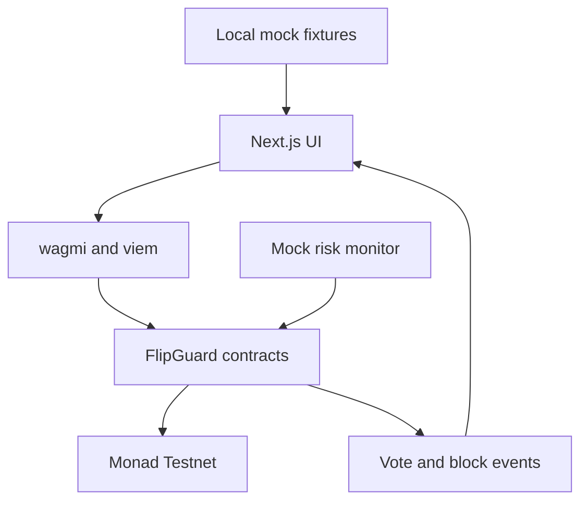

# FlipGuard: Monad Blitz Mumbai V4 Master Build Prompts

## 1. Project decision

**Project:** FlipGuard  
**One-line pitch:** FlipGuard is an onchain governance guard that detects suspicious last-minute voting-power acquisition and prevents flagged wallets from manipulating a proposal before voting closes.

**Tagline:** Fair votes. Stronger governance.

**Hackathon constraint:** Time is extremely limited. Build a narrow, working, publicly hosted MVP. Use controlled mock governance data and mocked risk signals, but execute proposal creation, voting checks, blocked votes, accepted votes, and event logs through real smart contracts deployed on Monad Testnet.

> Important honesty rule: the demo uses mock DAOs, mock proposals, mock voters, and a mock risk-monitoring service. Never claim that the system can universally prove a wallet used borrowed tokens just by inspecting its current balance. The MVP demonstrates an enforceable governance policy and an oracle/monitor integration point.

---

## 2. Non-negotiable MVP

Build only the following:

1. Connect an EVM wallet to Monad Testnet.
2. Display three mock governance proposals.
3. Display mock voter activity and risk explanations.
4. Create at least one real proposal on the deployed contract.
5. Allow a clean wallet to cast a real onchain vote.
6. Block a flagged or recently funded wallet from voting.
7. Display the transaction hash and Monad explorer link.
8. Display a transparent protection log from contract events.
9. Include a one-click demo reset or deterministic seed script.

Do not build:

- A production DAO framework
- AI or machine-learning detection
- Cross-chain governance
- A custom indexer
- A database or backend
- Real lending-protocol integrations
- Mainnet deployment before the testnet product is complete
- Token economics, NFTs, rewards, or unnecessary animations

### MVP success condition

The demo is complete only when the audience can see:

> The same proposal receives one legitimate vote, rejects one suspicious vote onchain, explains why it was rejected, and links to real Monad Testnet transactions.

---

## 3. Technical truth and threat model

FlipGuard must not make technically false claims.

### What the MVP can enforce

- Snapshot-based voting power using historical checkpoints
- A minimum token-holding period before a wallet may vote
- Rejection of wallets flagged by an authorized risk monitor
- Proposal start and end times
- One vote per wallet per proposal
- Rejection of nonexistent, inactive, or already-voted proposals
- Transparent onchain events for accepted and blocked votes

### What the MVP cannot prove by itself

- Whether tokens came from a flash loan or an ordinary transfer
- Whether multiple wallets belong to one person
- Whether a centralized exchange funded several related wallets
- Whether an externally supplied risk flag is correct
- Whether every form of governance manipulation has been detected

### Honest architecture

- **Onchain policy:** validates eligibility and enforces the vote decision.
- **Mock monitoring service:** supplies controlled risk flags for the demo.
- **Mock governance data:** provides realistic names, proposals, activity, and charts.
- **Monad Testnet:** records actual proposals, votes, blocks, and event logs.

---

## 4. Recommended stack

- **Frontend:** Next.js with TypeScript
- **Styling:** Tailwind CSS and a minimal component library already present in the starter
- **Wallet/Web3:** wagmi + viem, using one wallet connector that works reliably
- **Contracts:** Solidity + Foundry
- **Contract libraries:** OpenZeppelin only where necessary
- **Network:** Monad Testnet
- **Hosting:** Vercel, Netlify, or another public host already familiar to the team
- **Data:** local TypeScript/JSON fixtures plus contract reads and events
- **Testing:** Foundry unit tests and a short frontend smoke-test checklist

Do not switch frameworks after implementation begins. Reuse the event starter repository if the organizer requires it.

---

## 5. Monad Testnet configuration

Use the current official Monad documentation as the authority if any value changes.

```text
Network name: Monad Testnet
Chain ID: 10143
Currency symbol: MON
RPC URL: https://testnet-rpc.monad.xyz
Faucet: https://faucet.monad.xyz
App hub: https://testnet.monad.xyz
```

Frontend environment variables:

```bash
NEXT_PUBLIC_MONAD_RPC_URL=https://testnet-rpc.monad.xyz
NEXT_PUBLIC_MONAD_CHAIN_ID=10143
NEXT_PUBLIC_FLIPGUARD_CONTRACT_ADDRESS=
NEXT_PUBLIC_GOVERNANCE_TOKEN_ADDRESS=
NEXT_PUBLIC_BLOCK_EXPLORER_URL=
```

Never commit a private key. Use a dedicated hackathon deployer wallet and a Foundry keystore. Keep `.env*`, keystores, deployment secrets, and local wallet files out of Git.

---

## 6. Minimal architecture



### Suggested repository layout

```text
flipguard/
├── app/
│   ├── page.tsx
│   ├── dashboard/page.tsx
│   └── proposals/[id]/page.tsx
├── components/
├── data/mock-data.ts
├── lib/
│   ├── contracts.ts
│   ├── monad.ts
│   └── demo.ts
├── contracts/
│   ├── src/
│   │   ├── FlipGuardGovernance.sol
│   │   ├── MockGovernanceToken.sol
│   │   └── MockRiskRegistry.sol
│   ├── script/Deploy.s.sol
│   └── test/FlipGuardGovernance.t.sol
├── public/
├── .env.example
└── README.md
```

If the starter repository has a different structure, adapt to it instead of reorganizing everything.

---

## 7. Master implementation prompt

Copy this entire prompt into the primary coding agent:

```text
You are the lead engineer for a one-day Monad hackathon. Build a complete MVP named FlipGuard inside the current repository.

PRODUCT
FlipGuard is an onchain governance guard that detects suspicious last-minute voting-power acquisition and blocks flagged wallets before a proposal closes. The product tagline is “Fair votes. Stronger governance.”

TIME CONSTRAINT
Time is extremely limited. Optimize for a small, working, testable and publicly deployable product. Do not overengineer. Do not add features outside the written MVP. Inspect the existing repository before changing anything and preserve useful starter code.

DATA POLICY
Use local mock data for DAO names, proposal descriptions, wallet histories, analytics and risk explanations. Clearly label mock or simulated information. All critical governance actions must still be real transactions against smart contracts deployed to Monad Testnet: proposal creation, allowed voting, blocked voting/risk enforcement and event emission.

TECHNICAL HONESTY
Do not claim that onchain balance inspection alone proves token borrowing. Implement an authorized mock risk registry/monitor for controlled risk flags, plus objective rules such as proposal snapshots and a minimum holding period. Explain this limitation in the UI and README.

REQUIRED FLOW
1. User opens a polished FlipGuard landing/dashboard.
2. User connects a wallet and is prompted to switch to Monad Testnet.
3. User opens a seeded mock proposal.
4. The UI shows voter risk status: Clean, Recent Token Acquisition, or Borrowing Risk Flag.
5. A clean wallet casts a real onchain vote and receives a transaction/explorer link.
6. A suspicious wallet attempts to vote and the contract rejects or records the blocked attempt according to the safest implementable design.
7. The UI displays the exact rejection reason and updates a protection log from contract events.

SMART CONTRACTS
Create a minimal governance token with voting checkpoints, a risk registry controlled by an owner/monitor role, and a governance contract with proposal creation, snapshot, start/end, minimum holding period or recent-acquisition rule, one-vote enforcement, risk assessment, allowed vote and blocked-vote events. Include Foundry deployment scripts and comprehensive unit tests. Keep the contracts small and auditable.

FRONTEND
Use Next.js, TypeScript, Tailwind, wagmi and viem unless the repository already uses equivalent tools. Follow the supplied FlipGuard brand direction: near-black/navy backgrounds, purple-to-violet primary accents, cyan detection accents, green success, amber warning and coral/red threat states. Use Inter or the existing sans-serif font. Build responsive screens with high contrast and no visual clutter.

PAGES
- Landing/dashboard with headline, protection summary and proposals
- Proposal detail with voting controls, risk assessment and activity timeline
- Protection log or dashboard section showing accepted and blocked actions

MOCK FIXTURES
Create three proposals and at least four mock wallets. Include one clean long-term holder, one recently funded wallet, one wallet flagged for borrowing risk, and one already-voted wallet. Use deterministic data so the demo is repeatable.

MONAD
Configure Monad Testnet chain ID 10143 and RPC https://testnet-rpc.monad.xyz. Put contract addresses and explorer base URL in public environment variables. Never hardcode secrets. Add graceful errors for the wrong network, rejected transactions, missing faucet funds and RPC failure.

QUALITY BAR
- No broken buttons or fake links
- No unlabelled mock claims
- No private keys in source or Git history
- Loading, success, empty and error states
- Mobile and desktop layout
- Accessible contrast and keyboard-focus styles
- Contract unit tests passing
- Frontend type-check and production build passing
- README with exact setup, deployment, verification and demo steps

DELIVERY
Work in this order: inspect repository, implement contracts/tests, deploy or prepare deployment, wire the frontend, seed the demo, test the complete flow, then improve presentation. After each phase, report changed files, commands run, results and the next blocking item. Do not spend time on optional features until the required end-to-end path works.
```

---

## 8. Smart-contract generation prompt

Use this prompt specifically for the Solidity implementation:

```text
Act as a senior Solidity engineer. Generate the smallest safe Foundry contract suite for the FlipGuard hackathon MVP on Monad Testnet.

Create:
1. MockGovernanceToken.sol: an ERC20Votes-compatible mock governance token with checkpoints and owner-controlled demo minting. Prevent accidental unrestricted production minting claims in comments and README.
2. MockRiskRegistry.sol: an Ownable or AccessControl registry where only an authorized monitor can set or clear a wallet risk flag and reason code. Reason codes: NONE, RECENT_ACQUISITION, BORROWING_RISK, WALLET_FLIP, MANUAL_REVIEW. Emit RiskFlagUpdated.
3. FlipGuardGovernance.sol: minimal proposal creation and voting enforcement.

Required governance behavior:
- Proposal fields: id, title hash or short title, proposer, snapshot block, start time/block, end time/block, for votes, against votes and status.
- Proposal creation validates a future end and emits ProposalCreated.
- Voting supports FOR and AGAINST only.
- Vote weight comes from historical checkpointed voting power at the proposal snapshot, not the current balance.
- Reject nonexistent proposals, votes outside the active period, zero voting power, repeat votes and wallets with a blocking risk flag.
- Add a configurable minimum-holding/recent-acquisition protection if it can be implemented correctly without pretending ERC20Votes reveals token provenance. If a separate lastInbound checkpoint is used, document its limitations and test transfers.
- Provide assessVoter(proposalId, voter) returning eligibility, vote weight and a machine-readable reason code for frontend simulation before submission.
- Emit VoteCast for accepted votes.
- For a reverted suspicious vote, a log cannot persist because EVM reverts roll back events. Do not falsely promise a BlockedVote event from the reverted transaction. Either (A) let assessVoter provide the preflight rejection and revert during castVote, or (B) implement a separate non-reverting recordBlockedAttempt function with strict anti-spam rules. Prefer A under time pressure.
- Use custom errors, checks-effects-interactions and no unnecessary external calls.
- Avoid upgradeability, proxies, delegation extensions, timelocks and token rewards.

Security requirements:
- Solidity ^0.8.24 or another version supported by the installed Foundry/OpenZeppelin stack.
- Use audited OpenZeppelin primitives where they reduce risk.
- No tx.origin.
- No secrets or private keys.
- Protect administrative methods.
- Test access control, boundary timestamps/blocks, snapshot voting, transfer-after-snapshot, zero votes, duplicate votes, flagged voters, flag clearing, proposal expiry and event contents.
- Add fuzz tests for invalid proposal IDs and voting-period boundaries if time permits.

Foundry requirements:
- contracts/foundry.toml configured for Monad, RPC https://testnet-rpc.monad.xyz, chain ID 10143 and network = "monad" where supported.
- contracts/script/Deploy.s.sol deploys token, registry and governance; assigns roles; seeds only the minimum demo state.
- Use a keystore/account deployment flow, not a plaintext private key command.
- Print deployed addresses and transaction hashes.
- Include exact forge build, forge test, deployment and verification commands in contracts/README.md.

Return complete compilable files, not pseudocode. Run forge fmt, forge build and forge test. Fix failures before reporting completion.
```

### Contract acceptance tests

- Clean holder has snapshot votes and can vote once.
- Recently funded holder is shown as ineligible when the implemented rule applies.
- Risk-flagged holder cannot vote.
- Clearing a flag restores eligibility if every other rule passes.
- Tokens transferred after snapshot do not increase proposal vote weight.
- A second vote reverts.
- A vote before start or after end reverts.
- Unauthorized accounts cannot change risk flags.
- Frontend preflight and contract enforcement return the same reason.

---

## 9. Frontend generation prompt

```text
Build the FlipGuard hackathon frontend in the existing Next.js repository. Time is limited, so implement only a reliable three-screen experience.

Visual direction:
- Premium dark governance/security product
- Near-black/navy background
- Purple and violet primary gradient
- Cyan detection accent
- Green safe, amber warning, coral/red blocked
- Inter typography or existing sans-serif
- Rounded panels, subtle borders, restrained glow
- Avoid generic crypto clutter, excessive gradients and unreadable glass effects

Screen 1: Landing/Dashboard
- FlipGuard logo/name and tagline “Fair votes. Stronger governance.”
- Headline “Protect governance before it’s too late.”
- Connect wallet button and Monad Testnet status
- Cards for Active Proposals, Protected Votes and Threats Blocked
- Three mock proposal cards labelled Demo Data

Screen 2: Proposal Detail
- Proposal title, description, end time and live status
- FOR/AGAINST totals from the contract where available
- Wallet risk assessment panel with status, snapshot voting power and exact reason
- Vote buttons disabled when ineligible
- Clear transaction states: awaiting wallet, pending, confirmed, blocked/reverted
- Explorer link after confirmation

Screen 3 or dashboard section: Protection Log
- Timeline of accepted votes, risk flag updates and blocked preflight attempts
- Distinguish contract events from simulated monitoring events
- Filter chips: All, Protected, Allowed, Flagged

Data:
- Use deterministic local fixtures for proposal copy, risk history and charts.
- Use contract reads/events for actual eligibility, proposal totals and confirmed votes.
- Add a visible “Hackathon demo: monitoring signals are simulated; enforcement is onchain on Monad Testnet” notice.

Engineering:
- wagmi + viem
- Monad Testnet chain ID 10143
- Contract addresses from NEXT_PUBLIC environment variables
- Wrong-network switch prompt
- No backend, database or custom indexer
- Avoid hydration errors
- Add loading skeletons, empty states and actionable errors
- Run lint, type-check and production build
```

---

## 10. Monad integration and deployment prompt

```text
Integrate and deploy FlipGuard to Monad Testnet. Do not change product scope.

1. Confirm the current official Monad Testnet network values from docs.monad.xyz.
2. Configure Foundry for chain ID 10143, RPC https://testnet-rpc.monad.xyz and Monad execution rules.
3. Use a dedicated encrypted Foundry keystore for the deployer. Never print, commit or paste a private key.
4. Obtain only test MON from the official faucet.
5. Run forge fmt, forge build and forge test before deployment.
6. Deploy MockGovernanceToken, MockRiskRegistry and FlipGuardGovernance.
7. Record addresses, deployment transaction hashes, deployer address, chain ID, compiler version and timestamp in deployments/monad-testnet.json.
8. Verify every deployed contract using the current official Monad verification guide. If verification fails, capture the exact error and fix constructor arguments/compiler settings instead of skipping it.
9. Set NEXT_PUBLIC contract addresses and explorer URL in the frontend host.
10. Execute one accepted vote and one rejected eligibility scenario on testnet.
11. Add working explorer links to the UI and README.
12. Verify the hosted app from a clean browser session and a second wallet if available.

Return a compact deployment report with URLs, addresses, transaction hashes, verification status, test results and any honest limitation.
```

---

## 11. Mock-data prompt

```text
Generate deterministic TypeScript mock fixtures for FlipGuard. Do not generate random data at runtime.

Include:
- DAO: Atlas Protocol DAO
- Three proposals: Treasury Diversification, Validator Incentive Adjustment, Emergency Security Council Renewal
- Four labelled demo wallets: Long-Term Holder, Recently Funded Wallet, Borrowing-Risk Wallet, Already-Voted Wallet
- Realistic shortened addresses that are replaced with configured testnet addresses when available
- Timeline events showing token acquisition, risk flag, eligibility check, allowed vote and rejected vote
- Dashboard totals consistent with the individual records
- Clear isMock or source fields on every record

Use concise professional copy. Do not claim the mock records came from real users, lenders or DAOs.
```

---

## 12. Testing and repair prompt

```text
Audit the complete FlipGuard repository as a release candidate for a one-day hackathon.

Do not add features. Find and fix only issues that could break the demo, deployment, correctness, security or judging requirements.

Validate:
- forge fmt --check, forge build and forge test
- frontend lint, TypeScript check and production build
- no private keys, secrets, keystores or sensitive .env files are tracked
- Monad Testnet chain ID and RPC are correct
- contract addresses are loaded from environment variables
- wallet connect, switch network, eligibility preflight, accepted vote and rejected vote work
- snapshot voting weight cannot be inflated after the snapshot
- risk-registry access control works
- transaction and explorer links are real
- mock data is visibly disclosed
- no button, route or external link is broken
- README setup works from a fresh clone
- mobile layout is usable

Produce a severity-ranked report, fix critical/high issues, rerun every relevant check, and report the final evidence. Do not say “passed” without command output or a manual test result.
```

---

## 13. README generation prompt

```text
Write a concise but reproducible README for FlipGuard.

Required sections:
1. Product name, tagline and one-sentence value proposition
2. Problem
3. Solution
4. Demo flow
5. Why Monad
6. Architecture
7. Smart contracts
8. Mock-data disclosure and technical limitations
9. Monad Testnet deployments table with contract addresses and explorer links
10. Local setup from a clean clone
11. Environment variables using placeholders only
12. Contract build, test, deployment and verification commands
13. Frontend development and production-build commands
14. Security considerations
15. Screenshots or short demo GIF/video link
16. Public hosted-app URL
17. Team members
18. License

Be factual. Do not describe planned features as completed. Do not claim universal flash-loan detection. State that the hackathon MVP uses simulated monitoring signals with real onchain enforcement.
```

---

## 14. Three-minute demo prompt

```text
Create a three-minute live demo script for FlipGuard using only features confirmed to work.

Timing:
- 0:00–0:20: problem and one-line solution
- 0:20–0:40: architecture and honest mock-data disclosure
- 0:40–1:15: open proposal and show clean wallet eligibility
- 1:15–1:50: cast a real vote on Monad Testnet and open explorer transaction
- 1:50–2:25: show suspicious wallet, risk reason and blocked vote/preflight
- 2:25–2:45: show protection log and immutable contract state
- 2:45–3:00: market, future integration and closing line

Use this closing line:
“FlipGuard makes governance rules enforceable before manipulated voting power becomes an irreversible decision.”

Do not depend on a live faucet, redeployment or slow setup during the demo. Keep a backup recording and pre-funded wallets ready.
```

---

## 15. Build-in-public and submission prompt

```text
Prepare FlipGuard’s hackathon submission package without inventing metrics.

Create:
- Project title and 50-word description
- One-line pitch
- Public GitHub URL placeholder
- Hosted app URL placeholder
- Monad Testnet contract addresses and explorer links placeholders
- 30–45 second product demo-video script
- 15–25 second creative ad-video script
- One launch post and one progress post, tagging the organizer accounts exactly as required by the current portal
- Five screenshots: landing, proposal, clean assessment, blocked assessment and explorer transaction
- Reproduction checklist
- Final submission checklist

Every public asset must disclose that risk-monitor signals and DAO data are simulated for the MVP, while smart-contract enforcement and transactions run on Monad Testnet. Do not claim users, revenue, partnerships or detection accuracy without evidence.
```

### Suggested launch post

```text
Introducing FlipGuard 🛡️

Governance attacks often arrive when voting is about to close. FlipGuard checks snapshot voting power, minimum holding rules and risk-monitor signals before a vote is accepted.

Built on Monad Testnet: real onchain enforcement, transparent protection logs and a demo showing a clean vote accepted while suspicious voting power is blocked.

[APP] [REPO] [DEMO]
```

---

## 16. Time-boxed execution plan

Adjust the clock to the actual remaining time. Do not treat these as guaranteed event times.

| Remaining block | Work | Exit condition |
|---|---|---|
| 45 min | Repository setup, contracts and tests | Contracts compile; critical tests pass |
| 30 min | Testnet deployment and verification | Addresses and explorer links recorded |
| 75 min | Frontend core flow | Connect, assess and vote work |
| 30 min | Demo fixtures and polish | Repeatable clean/blocked scenarios |
| 30 min | Hosted deployment and clean-browser QA | Public URL works |
| 30 min | README, screenshots and videos | Evidence uploaded and linked |
| Final buffer | Submission and backup | Portal accepted; links rechecked |

If behind schedule, cut in this order:

1. Charts
2. Separate protection-log page; keep it as a dashboard section
3. Multiple DAOs
4. Fancy motion
5. Additional proposals

Never cut the real Monad Testnet transaction, contract tests, public deployment, README, or mock-data disclosure.

---

## 17. Hackathon compliance checklist

The organizer message and newer judging rubric should override older public copy where they conflict. The public Luma page still described peer judging when reviewed, so confirm the current event portal before submission.

### Product and eligibility

- [ ] Team has no more than three members
- [ ] Project complies with the fresh-build requirement
- [ ] Correct official starter/fork is used if explicitly required
- [ ] Public GitHub repository
- [ ] Meaningful commit history created during the event
- [ ] Complete README with reproducible setup
- [ ] Publicly hosted application
- [ ] Monad Testnet contract deployment
- [ ] Contracts verified on a supported explorer
- [ ] Contract address and transaction links visible
- [ ] All announced features work
- [ ] No private keys or secrets in Git history

### Build-in-public evidence

- [ ] Required organizer/project tags confirmed from the live portal
- [ ] Project announcement posted
- [ ] Running demo video meets the required minimum duration
- [ ] Creative/ad video posted if required
- [ ] View-count evidence captured before submission cutoff if scored
- [ ] Post URLs saved in the submission form

### Demo and submission

- [ ] Three-minute pitch rehearsed
- [ ] Pre-funded test wallets ready
- [ ] Clean-wallet transaction rehearsed
- [ ] Suspicious-wallet rejection rehearsed
- [ ] Backup screen recording available
- [ ] Code frozen by the organizer’s deadline
- [ ] Submission completed before the portal closes
- [ ] Hosted URL, repo, video, posts and contract links re-opened from incognito
- [ ] Submission confirmation screenshot saved

### Items that require organizer confirmation

- [ ] Latest judging method, because older event copy may still say peer-judged
- [ ] Whether an official repository must be forked
- [ ] Exact social accounts and hashtags to tag
- [ ] Exact code-freeze and submission times shown in the live event portal
- [ ] Whether testnet only is eligible and whether mainnet/custom-domain bonuses still apply
- [ ] Whether mock data must be disclosed in a particular submission field

---

## 18. Final release-gate prompt

Run this last, with enough time left to fix failures:

```text
Act as the final release manager for FlipGuard. Time is almost over. Do not add or redesign anything.

Check the current repository and return PASS or FAIL with direct evidence for each:
1. Public repository and event-compliant history
2. Contract compile and tests
3. Monad Testnet deployment
4. Contract verification
5. Hosted frontend
6. Wallet connection and correct network
7. Clean vote accepted onchain
8. Suspicious vote prevented with an accurate reason
9. Explorer links work
10. Mock data clearly disclosed
11. README reproducible from a clean clone
12. No secrets committed
13. Demo video, ad video and social post links ready
14. Three-minute script ready
15. Submission fields and confirmation captured

Fix only critical failures that are inside the repository. For anything requiring a human or organizer, provide the shortest exact action. End with either SHIP or DO NOT SHIP.
```

---

## 19. Claude scaffolding prompts

These prompts are designed for Claude Code working inside the repository. Run them in order. Do not paste all of them at once unless Claude has enough context and time.

### Prompt 1: Inspect and scaffold the repository

```text
You are working inside the FlipGuard hackathon repository. Time is extremely limited.

First inspect the current repository, package manager, framework, Git status and existing files. Do not delete useful starter code and do not replace an existing working stack merely because you prefer another one.

Then scaffold only the minimum structure required for this MVP:

flipguard/
├── app/
│   ├── layout.tsx
│   ├── page.tsx
│   ├── dashboard/page.tsx
│   └── proposals/[id]/page.tsx
├── components/
│   ├── wallet-button.tsx
│   ├── network-status.tsx
│   ├── proposal-card.tsx
│   ├── risk-assessment.tsx
│   ├── voting-panel.tsx
│   └── protection-log.tsx
├── data/mock-data.ts
├── hooks/use-flipguard.ts
├── lib/
│   ├── contracts.ts
│   ├── monad.ts
│   ├── types.ts
│   └── utils.ts
├── contracts/
│   ├── foundry.toml
│   ├── src/
│   │   ├── MockGovernanceToken.sol
│   │   ├── MockRiskRegistry.sol
│   │   └── FlipGuardGovernance.sol
│   ├── script/Deploy.s.sol
│   └── test/FlipGuardGovernance.t.sol
├── deployments/monad-testnet.json
├── public/
├── .env.example
└── README.md

Rules:
- If an equivalent file already exists, reuse it instead of creating a duplicate.
- Use the repository's existing package manager and lockfile.
- Use Next.js + TypeScript + Tailwind only if no frontend stack already exists.
- Use Foundry for Solidity.
- Do not implement product features yet. Create the structure, configuration, placeholder types and minimal compiling pages only.
- Add .env*, keystores, broadcast output and secrets to .gitignore without ignoring the public .env.example or deployment-address JSON.
- Configure Monad Testnet with chain ID 10143 and RPC https://testnet-rpc.monad.xyz.
- Use placeholders for contract addresses.
- Do not commit or push.

After scaffolding, run the cheapest relevant checks. Report:
1. Existing stack discovered
2. Files created or changed
3. Commands run and exact outcomes
4. Anything blocking the contract implementation
```

### Prompt 2: Install only essential dependencies

```text
Inspect package.json and the existing imports before installing anything. Add only missing dependencies required for FlipGuard.

Expected frontend needs, only if absent:
- wagmi
- viem
- @tanstack/react-query
- one lightweight wallet connector approach compatible with the existing stack

Expected contract dependency:
- OpenZeppelin Contracts through Foundry

Do not add Redux, a database client, chart library, animation library, indexer SDK, GraphQL, an AI SDK or multiple wallet kits. Do not upgrade unrelated packages. Use the existing package manager and preserve its lockfile.

After installation, run the frontend type-check/build and forge build. Fix dependency or configuration errors. Report the exact packages added and why each one is necessary. Do not commit or push.
```

### Prompt 3: Scaffold and implement contracts

```text
Now implement the three contracts in the existing contracts directory:

- MockGovernanceToken.sol
- MockRiskRegistry.sol
- FlipGuardGovernance.sol

Follow the complete “Smart-contract generation prompt” in FlipGuard_Hackathon_Master_Prompts.md exactly. Do not expand scope.

Important implementation decisions:
- Use checkpointed snapshot voting power.
- Use an authorized mock risk registry for demo risk flags.
- Expose assessVoter() for frontend preflight.
- A reverted transaction cannot retain an event. Do not claim that a rejected castVote transaction emitted a permanent BlockedVote event.
- Keep the governance contract minimal. No OpenZeppelin Governor modules, timelock, delegation UI, upgradeable proxy or treasury execution unless already working in the starter.
- Write deployment script and tests at the same time as the contracts.

Run forge fmt, forge build and forge test. Do not stop with uncompilable code. Do not deploy yet. Do not commit or push.

Report contract APIs, test count, exact test result and remaining risks.
```

### Prompt 4: Scaffold mock data and frontend shell

```text
Create deterministic FlipGuard mock fixtures and the responsive frontend shell.

Use the supplied FlipGuard visual identity:
- #0B0F1A or equivalent near-black navy background
- purple/violet primary accents
- cyan detection accent
- green verified state
- amber risk state
- coral/red blocked state
- Inter or the existing sans-serif font

Required mock content:
- Atlas Protocol DAO
- Three proposals
- Long-Term Holder
- Recently Funded Wallet
- Borrowing-Risk Wallet
- Already-Voted Wallet
- Consistent activity timeline and totals
- isMock/source labels

Build reusable components, but do not create a design system framework. Implement the landing/dashboard, proposal detail and protection-log section. Use placeholders for onchain values until the next phase.

Every page must display this disclosure in an appropriate location:
“Hackathon demo: DAO activity and monitoring signals are simulated. Governance enforcement runs on Monad Testnet.”

Run lint, type-check and production build. Fix failures. Do not commit or push.
```

### Prompt 5: Wire the contracts to the frontend

```text
Connect the FlipGuard frontend to the deployed-contract interfaces without deploying yet.

Requirements:
- Define Monad Testnet as chain ID 10143.
- Load RPC and contract addresses from NEXT_PUBLIC environment variables.
- Add wallet connect and explicit wrong-network handling.
- Add typed ABIs generated from the Foundry build artifacts or a single maintained ABI source. Do not duplicate hand-written ABIs across components.
- Implement reads for proposal details, vote totals, voter eligibility and risk reason.
- Implement write flow for castVote.
- Show wallet confirmation, pending, confirmed, rejected and failed states.
- Show an explorer link only when a real transaction hash exists.
- Preserve mock data for descriptive content and monitoring history, but do not present mock transaction hashes as real.
- If addresses are absent, enter a clear Demo Preview mode instead of crashing.

Run type-check and production build. Fix failures. Do not commit or push.
```

### Prompt 6: Deploy and seed Monad Testnet

```text
Prepare and execute the Monad Testnet deployment only after all local contract tests pass.

Safety:
- Use a dedicated hackathon deployer and encrypted Foundry keystore.
- Never ask me to paste a private key into chat or write it into a command, file or Git-tracked environment variable.
- Check that the deployer is on chain ID 10143 and has sufficient test MON.

Steps:
1. Rerun forge fmt, forge build and forge test.
2. Deploy the three contracts with Deploy.s.sol.
3. Save addresses, deployer, chain ID, transaction hashes, compiler version and timestamp in deployments/monad-testnet.json.
4. Verify all contracts using the current official Monad Foundry verification process.
5. Seed the minimum deterministic demo state: token voting power, one active proposal and controlled risk flags.
6. Update only public contract-address environment configuration. Never commit secrets.
7. Execute read-only checks confirming the contracts and seeded proposal.

If deployment or verification fails, stop and provide the exact error plus the shortest fix. Never fabricate addresses or verification status. Do not commit or push.
```

### Prompt 7: End-to-end repair

```text
Run the full FlipGuard demo locally against the actual Monad Testnet deployment.

Test these exact scenarios:
1. Wrong network receives a switch prompt.
2. Clean wallet receives an eligible assessment.
3. Clean wallet casts one confirmed vote.
4. Repeated vote is rejected.
5. Risk-flagged wallet receives the correct preflight reason and cannot cast a valid vote.
6. Proposal totals update after confirmation.
7. Explorer links open the real transaction/contract.
8. Missing RPC or contract address produces a usable error/preview state.

Fix only demo-breaking issues. Do not redesign the UI or add features. Run forge tests and frontend production build again. Return direct evidence for each scenario. Do not commit or push.
```

### Prompt 8: README and submission assets

```text
Finish the documentation and submission package for FlipGuard.

Use the README and submission prompts in FlipGuard_Hackathon_Master_Prompts.md. Fill only facts that can be verified from the repository and deployment output.

Required outputs:
- Complete README.md
- Working hosted-app placeholder or actual URL
- Deployment table with real addresses and explorer links
- Three-minute demo script
- 30–45 second product video script
- 15–25 second ad script
- Launch post
- Five-screenshot checklist
- Final portal-submission checklist

Clearly distinguish completed features from future work. Clearly disclose simulated DAO and monitoring data. Do not claim flash-loan detection accuracy, real customers, revenue, partnerships or views without evidence.

Run link/path checks and the production build. Do not commit or push.
```

### Prompt 9: Final Claude audit

```text
Time is nearly finished. Act as a strict release auditor. Do not add features and do not make cosmetic changes unless they fix a broken demo.

Read FlipGuard_Hackathon_Master_Prompts.md and inspect the repository. Check contracts, tests, frontend build, deployment record, explorer links, README, mock-data disclosure, secret hygiene and submission assets.

Return a table with Requirement, PASS/FAIL, Evidence and Exact Fix. Fix critical repository failures, rerun checks, and finish with SHIP or DO NOT SHIP.

Do not commit or push. I will review and push manually.
```

### One-command Claude prompt when time is extremely short

Use this only if there is not enough time to run the phased prompts:

```text
Build FlipGuard end to end in the current repository using FlipGuard_Hackathon_Master_Prompts.md as the authoritative specification.

Time is extremely limited. First inspect the repo, then create the minimum scaffold, implement and test the Foundry contracts, build the deterministic mock-data frontend, connect it to Monad Testnet, prepare deployment/verification, and finish the README and demo assets.

Prioritize in this strict order:
1. Compiling and tested contracts
2. Real Monad Testnet deployment and verification
3. Wallet connection and clean vote
4. Risk-flagged vote prevention with an accurate reason
5. Public production build
6. README and submission evidence
7. Visual polish

Use mock DAO/activity/monitoring data and label it clearly. Critical governance actions must use real Monad Testnet contracts. Never fabricate deployment results, transaction hashes or verification. Never expose or commit private keys. Do not add a backend, database, AI, indexer, cross-chain support, NFTs, rewards or unrelated features.

Run checks after every phase. Fix failures before continuing. Do not commit or push; I will do that manually. At the end, report changed files, test/build results, deployment evidence, unresolved blockers and the shortest remaining submission checklist.
```

---

## 20. Sources checked

- [Monad Blitz Mumbai V4 event page](https://luma.com/monad-blitz-mumbai-september-2026)
- [Monad Blitz Mumbai V4 hack portal](https://blitz.devnads.com/events/monad-blitz-mumbai-v4)
- [Monad Blitz Mumbai V4 organizer page](https://monad-foundation.notion.site/Monad-Blitz-Mumbai-V4-3df6367594f2809fa7c9e1bf154407db)
- [Monad developer documentation](https://docs.monad.xyz/)
- [Monad Testnet network information](https://docs.monad.xyz/developer-essentials/testnet)
- [Monad Foundry deployment guide](https://docs.monad.xyz/guides/deploy-smart-contract/foundry)
- [Monad Foundry verification guide](https://docs.monad.xyz/guides/verify-smart-contract/foundry)

The event’s public pages can become stale or conflict with organizer messages. Always use the latest live portal and organizer announcement for deadlines, judging and submission fields.
