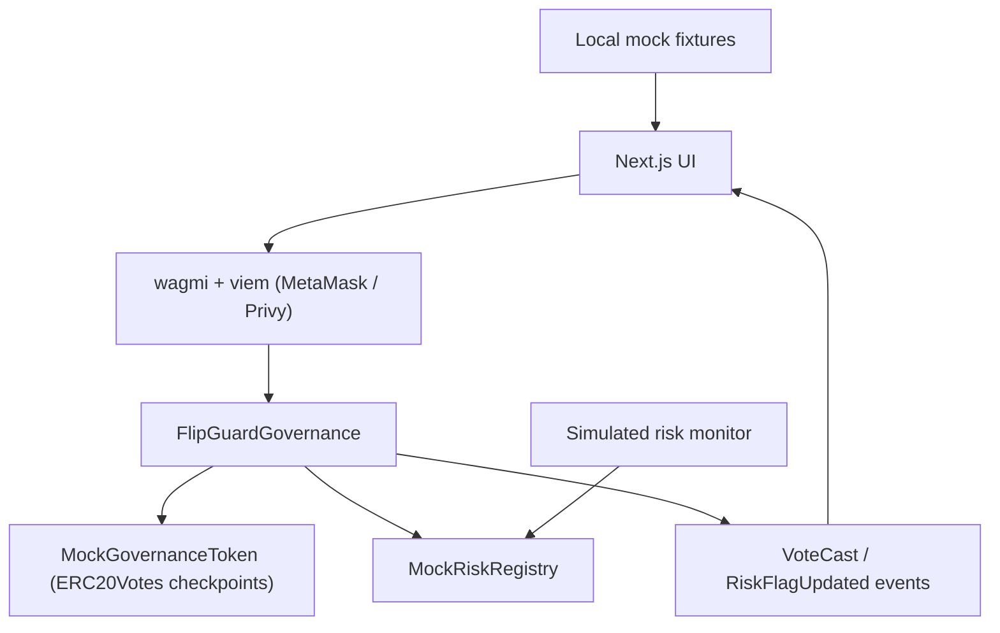

# FlipGuard 🛡️

**Fair votes. Stronger governance.**

FlipGuard is an onchain governance guard that detects suspicious last-minute voting-power acquisition and prevents flagged wallets from manipulating a proposal before voting closes.

> **Hackathon demo:** DAO activity and monitoring signals are simulated. Governance enforcement runs on Monad Testnet.

## Problem

DAO votes are often decided in the final hours. An attacker can borrow or buy tokens just before a vote, swing the result, and exit. By the time anyone notices, the decision is irreversible.

## Solution

Every vote passes three onchain checks before it counts:

1. **Snapshot voting power.** Weight comes from checkpointed balances at proposal creation. Tokens acquired afterwards add nothing.
2. **Minimum holding period.** Tokens that arrived within `minHoldingPeriod` of the snapshot are rejected (`RECENT_ACQUISITION`).
3. **Risk registry.** An authorized monitor can flag wallets (`BORROWING_RISK`, `WALLET_FLIP`, …). Flagged votes are rejected (`RISK_FLAGGED`).

`assessVoter()` exposes the same logic as a free preflight, so the UI shows the exact reason before a wallet ever signs.

## Demo flow

1. Connect MetaMask (or log in with Privy) and switch to Monad Testnet.
2. Open *Treasury Diversification*: see live eligibility for the clean, recently funded and borrowing-risk wallets.
3. The clean holder casts a real vote → confirmed tx + explorer link.
4. A suspicious wallet tries → the contract reverts with `VoteBlocked(reason)` and the UI shows why.
5. The protection log shows contract events, blocked preflights and simulated monitor signals, each labelled.

## Why Monad

400 ms blocks and fast finality mean vote enforcement and feedback feel instant, even during end-of-vote rushes. Full EVM compatibility lets us reuse audited OpenZeppelin `ERC20Votes` checkpoints unchanged.

## Architecture



No backend, database or indexer.

## Smart contracts (`contracts/src`)

| Contract | Role |
|---|---|
| `MockGovernanceToken` | ERC20Votes with a timestamp clock, auto self-delegation and `lastAcquiredAt`. Owner can mint (demo only). |
| `MockRiskRegistry` | Owner-managed monitors set/clear a risk flag per wallet. Emits `RiskFlagUpdated`. |
| `FlipGuardGovernance` | `createProposal`, `assessVoter`, `castVote` (FOR/AGAINST, one vote per wallet), `VoteCast` events, custom errors. |

14 Foundry tests cover snapshot weight, transfer-after-snapshot, holding period, flags and clearing, duplicate votes, window boundaries, access control and fuzzing.

## Mock-data disclosure and technical limitations

- DAO names, proposal copy, wallet histories and the activity timeline are **simulated fixtures** (`data/mock-data.ts`) and labelled in the UI.
- Risk flags are written by the deployer acting as a **simulated monitor**. FlipGuard does not detect flash loans itself.
- `lastAcquiredAt` records *when* tokens last arrived, not *where from*. It cannot tell a loan from a purchase, and any inbound transfer restarts the holding period.
- Wallets controlled by one person, or funded by the same exchange, are not linked.
- A reverted transaction keeps no events, so blocked attempts are logged from the preflight in the user's browser, not onchain.
- The protection log scans only recent blocks (RPC log-range limits).

## Monad Testnet deployments

| Contract | Address | Explorer |
|---|---|---|
| FlipGuardGovernance | `0x4F9f04C3E913F418a656DB14003c63ea97653F92` | [view](https://testnet.monadexplorer.com/address/0x4F9f04C3E913F418a656DB14003c63ea97653F92) |
| MockRiskRegistry | `0x1d6B5b0d67B00bb7F1066B97B89F4CA290b1fD10` | [view](https://testnet.monadexplorer.com/address/0x1d6B5b0d67B00bb7F1066B97B89F4CA290b1fD10) (verified) |
| MockGovernanceToken | `0xFc7713f3af49D59C0b76D1d87E2c11BB2E29ddbF` | [view](https://testnet.monadexplorer.com/address/0xFc7713f3af49D59C0b76D1d87E2c11BB2E29ddbF) (verified) |

Details: [`deployments/monad-testnet.json`](deployments/monad-testnet.json).

## Setup, build, test, deploy

Full step-by-step instructions are in **[RUNNING_LOCALLY.md](RUNNING_LOCALLY.md)**. Short version:

```bash
npm install
(cd contracts && forge install foundry-rs/forge-std OpenZeppelin/openzeppelin-contracts --no-git && forge test)
# create .env (see RUNNING_LOCALLY.md §2)
npm run dev
```

### Environment variables

One git-ignored `.env` at the repo root holds everything (see [RUNNING_LOCALLY.md §2](RUNNING_LOCALLY.md)).

### Commands

| Task | Command |
|---|---|
| Contract build / test | `cd contracts && forge build && forge test` |
| Deploy | `npm run deploy` |
| Seed / reset demo | `npm run seed` |
| Regenerate ABI | `npm run abi` |
| Dev server | `npm run dev` |
| Checks | `npm run typecheck && npm run lint && npm run build` |

## Security considerations

- No private keys in the repo. The testnet-only deployer key lives in the git-ignored `.env`; broadcast output is git-ignored too.
- Admin functions (`mint`, `setMonitor`, `setMinHoldingPeriod`) are `onlyOwner`; `setRisk` requires the monitor role.
- No `tx.origin`, no upgradeability, no external calls beyond trusted token/registry reads.
- The token's unrestricted owner mint exists for the demo only. Do not reuse it in production.

## Screenshots / demo video

_Add links here._

## Hosted app

_Add URL here._

## Team

_Add names here._

## License

MIT
