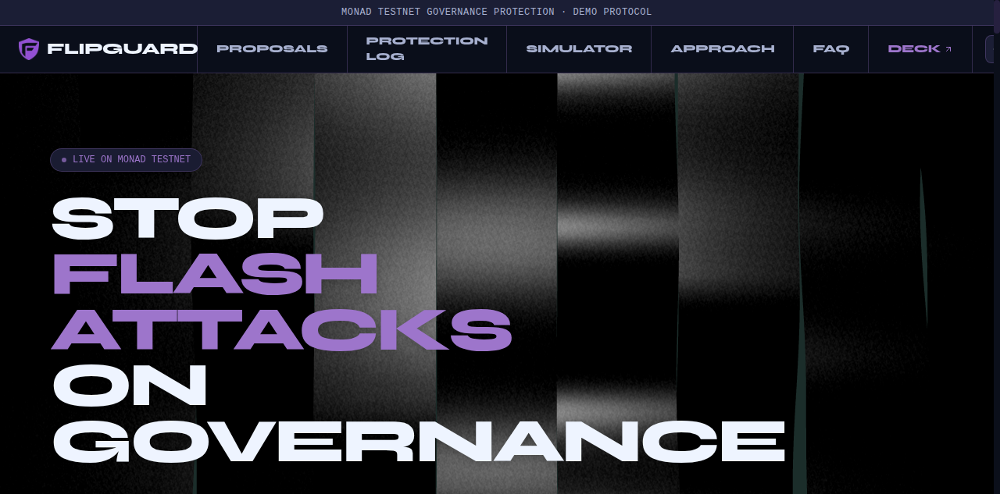
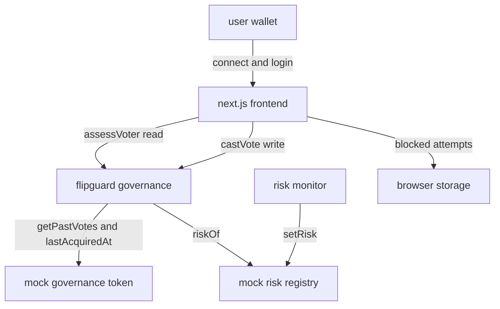

# FlipGuard

> **Fair votes. Stronger governance.**  
> Onchain governance protection for Monad Testnet. FlipGuard blocks last-minute voting power grabs before they can swing a proposal.

**Live Application:** [https://flipguard.younix.xyz/](https://flipguard.younix.xyz/)  
**Network:** Monad Testnet (Chain ID `10143`)  
**Socials:** [](https://x.com/justvamsi7/status/2101266870963999227?s=20) [](https://lnkd.in/p/gki3dQaS) [](https://www.instagram.com/reel/DdeAJIXgVG1/?stkn=amd0ZXU4cjU2c3V4)



## demo video

https://github.com/raptor7197/monad-hack/assets/demo-video

<video src="https://github.com/raptor7197/monad-hack/raw/main/public/FlipGuard%20Demo.mp4" controls width="100%"></video>

> *If video fails to play inline, download or watch [FlipGuard Demo.mp4](public/FlipGuard%20Demo.mp4).*

## the problem

dao votes are often decided in the final hours. an attacker can borrow a large amount of governance tokens, vote on a malicious proposal, and repay the loan in the same transaction. standard `erc20votes` checkpoints only track balances, not when the tokens arrived, so a wallet funded seconds before a snapshot looks the same as a long term holder.

flipguard closes that window at the contract level. no backend, no oracle, no off chain bot needed to enforce it.

## how it works

every vote must pass three independent onchain checks before it is counted:

1. snapshot weight. `token.getPastVotes(voter, snapshot)` must be greater than zero. tokens bought after the snapshot do not count.
2. minimum holding period. `token.lastAcquiredAt(voter) + minHoldingPeriod` must be at or before the snapshot. tokens that arrived inside the window are rejected.
3. risk registry. `registry.riskOf(voter)` must be `NONE`. an authorized monitor flags wallets, and the contract rejects any flagged wallet.

a blocked vote reverts with `VoteBlocked(reason)`. a reverted transaction keeps no events, so the frontend uses the `assessVoter` view function as a free preflight. the wallet is never asked to sign a vote that would fail, so no gas is wasted.

`assessVoter(id, voter)` returns four values in one call:

```text
eligible  bool
weight    uint256
reason    Reason
risk      MockRiskRegistry.Risk
```

`castVote` runs the same checks and then enforces one vote per wallet through `hasVoted`.

### revert reasons

the `Reason` enum is the index used across the contract and the ui.

| index | code | meaning |
|---|---|---|
| 0 | `ELIGIBLE` | passes every check |
| 1 | `NO_PROPOSAL` | proposal id does not exist yet |
| 2 | `NOT_ACTIVE` | outside the voting window |
| 3 | `ALREADY_VOTED` | this wallet already voted |
| 4 | `NO_VOTING_POWER` | zero checkpointed weight at snapshot |
| 5 | `RISK_FLAGGED` | monitor flagged the wallet |
| 6 | `RECENT_ACQUISITION` | tokens arrived inside the holding window |

## architecture



- `user` is a metamask wallet or a privy embedded wallet.
- `app` is the next.js frontend. it reads state with viem and writes with wagmi.
- `gov` is `FlipGuardGovernance`. it holds proposals, tallies, and all guard logic.
- `token` is `MockGovernanceToken`, an `erc20votes` token with a `lastAcquiredAt` stamp per wallet.
- `reg` is `MockRiskRegistry`, a monitor role plus a per wallet risk flag.
- `monitor` writes flags. in the demo it is simulated.
- `browser` keeps a local list of blocked preflight attempts for the dashboard, since reverted votes leave no onchain trace.

## contracts

sources live in `contracts/src`.

| file | role |
|---|---|
| `FlipGuardGovernance.sol` | proposals, `assessVoter`, `castVote`, revert reasons, `minHoldingPeriod` |
| `MockGovernanceToken.sol` | `erc20` + `erc20permit` + `erc20votes`, owner mint, timestamp checkpoints, `lastAcquiredAt`, auto self delegate |
| `MockRiskRegistry.sol` | monitor role, `setRisk`, `riskOf`, `RiskFlagUpdated` events |

key details:

- the snapshot is taken in `createProposal`. voting opens one second later and runs for `duration` seconds.
- the token uses timestamp based checkpoints, so `block.timestamp` is the clock.
- a holder is delegated to itself on first receipt, which keeps the demo wallets simple.
- `lastAcquiredAt` only records when tokens last arrived. it does not know if they came from a loan or a purchase. it only enables the holding period rule.
- the governance contract is `Ownable` and only the owner can change `minHoldingPeriod`.

## deployments

monad testnet, chain id `10143`. full record in `deployments/monad-testnet.json`.

| resource | address / url |
|---|---|
| **Live App** | [https://flipguard.younix.xyz/](https://flipguard.younix.xyz/) |
| `FlipGuardGovernance` | `0x4F9f04C3E913F418a656DB14003c63ea97653F92` |
| `MockRiskRegistry` | `0x1d6B5b0d67B00bb7F1066B97B89F4CA290b1fD10` |
| `MockGovernanceToken` | `0xFc7713f3af49D59C0b76D1d87E2c11BB2E29ddbF` |

`minHoldingPeriod` is 60 seconds on the deployed instance.

## frontend

app router pages:

| route | what it shows |
|---|---|
| `/` | hero, stats, defense simulator, code playground, approach, proposals, protection log, faq |
| `/proposals/[id]` | live voting panel, onchain tally, per wallet risk checks, activity |
| `/dashboard` | deployed contracts, full protection log, local blocked attempt list |
| `/slides` | pitch deck with gsap scrolltrigger pinned cards |
| `/ppt` | plain presentation view of the same content |

notable modules:

- `lib/contracts.ts` reads all addresses from env, maps the `Reason` and `Risk` enums to ui tones, and derives demo wallets when env is missing.
- `lib/monad.ts` defines the monad testnet chain and the wagmi and privy configs.
- `lib/session-log.ts` stores blocked preflight attempts in `localStorage`.
- `data/mock-data.ts` holds deterministic demo fixtures for proposals, wallets, and the timeline. every record is simulated.
- `lib/abi.ts` is generated by `scripts/gen-abi.mjs` from `contracts/out`. do not edit it by hand.

## tech stack

| layer | tools |
|---|---|
| frontend | next.js 16, react 19, typescript |
| styling | tailwind css v4, css variables |
| motion and 3d | gsap, scrolltrigger, three.js, `@react-three/fiber`, `@react-three/drei`, lenis |
| web3 | wagmi, viem, privy (optional) |
| contracts | solidity `^0.8.24`, foundry, openzeppelin, solc 0.8.28 |
| testing | foundry, fuzzing |

## repo layout

```text
app/                  next.js routes and global styles
components/            ui sections, voting panel, risk assessment, header, footer
data/mock-data.ts      deterministic demo fixtures
lib/                   abi, contract reads, chain config, session log, utils
contracts/src          solidity sources
contracts/script       deploy and seed foundry scripts
contracts/test         foundry tests
deployments/           deployed addresses per network
scripts/gen-abi.mjs    regenerates lib/abi.ts from forge output
public/                logo and static assets
```

## run locally

```bash
# install
npm install

# dev server
npm run dev

# contracts, requires .env
npm run deploy
npm run seed

# regenerate lib/abi.ts after contract changes
npm run abi

# checks
npm run typecheck
npm run lint
npm run build

# foundry tests
cd contracts && forge test
```

`npm run deploy` and `npm run seed` read `.env` and broadcast to monad testnet. run `seed` after the holding period has passed so the demo proposals open correctly. a full walkthrough is in `RUNNING_LOCALLY.md`.

## environment

one `.env` file is shared by next.js and the foundry scripts. it is git ignored.

```text
PRIVATE_KEY                              deployer key, testnet only
DEPLOYER_ADDRESS
MIN_HOLDING_PERIOD
PROPOSAL_DURATION
NEXT_PUBLIC_MONAD_RPC_URL
NEXT_PUBLIC_MONAD_CHAIN_ID
NEXT_PUBLIC_BLOCK_EXPLORER_URL
NEXT_PUBLIC_FLIPGUARD_CONTRACT_ADDRESS
NEXT_PUBLIC_GOVERNANCE_TOKEN_ADDRESS
NEXT_PUBLIC_RISK_REGISTRY_ADDRESS
NEXT_PUBLIC_FIRST_PROPOSAL_ID
NEXT_PUBLIC_DEMO_CLEAN_WALLET
NEXT_PUBLIC_DEMO_FLAGGED_WALLET
NEXT_PUBLIC_DEMO_RECENT_WALLET
NEXT_PUBLIC_DEMO_VOTED_WALLET
NEXT_PUBLIC_PRIVY_APP_ID
```

if `NEXT_PUBLIC_PRIVY_APP_ID` is set the header uses privy login. if it is empty the header connects to metamask directly. if the contract addresses are empty the ui hides the live tally and shows the demo fixtures instead.

## tests

`contracts/test/FlipGuardGovernance.t.sol` has 14 tests covering:

- clean holder votes once and the against vote counts
- flagged holder is blocked, and clearing the flag restores eligibility
- recent acquisition is blocked
- a transfer after the snapshot adds no weight
- zero power wallets are blocked
- voting window boundaries
- proposal created event and zero duration revert
- monitor only can set risk, owner only admin
- fuzzing on unknown proposals and window boundaries

## security notes

- `MockGovernanceToken` owner mint is demo only. it is not a production token.
- admin functions use owner or monitor checks. there is no upgradeability and no `tx.origin`.
- blocked votes produce no onchain events. the dashboard log is local to the browser on purpose.
- the risk monitor is simulated in this demo. the registry stores flags, it does not detect anything by itself.

## demo wallets

the seed script funds a recently active wallet and the deploy script flags a borrowing risk wallet. the ui maps three states for the demo:

| wallet | expected result |
|---|---|
| clean holder | `ELIGIBLE` |
| recently funded | `RECENT_ACQUISITION` |
| flagged wallet | `RISK_FLAGGED` |

## built for

monad blitz mumbai, september 2026.
